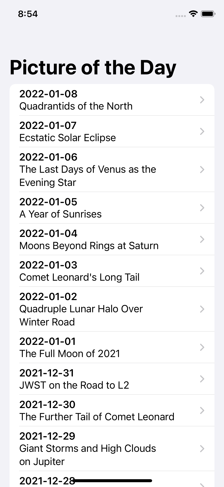

# SwiftUI example project - Astronomy Picture of the Day API

get an API key at https://api.nasa.gov

change in Constant.swift

static let key = "DEMO_KEY"

## Youtube tutorials
PART 1  https://youtu.be/h77vfLo8eaA

PART 2 https://youtu.be/bS_XrFyX8Bk

 
 
